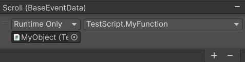
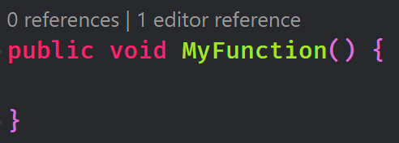

# Unity References

A Visual Studio Code extension for resolving code references in Unity objects

## Features

This extension provides codelenses for C# methods, showing where these methods are used in non-script Unity objects.
For example, given an editor function reference like:

...The reference will show up like:

You can then interact with the codelens (or hover over it) to show the list of references.

## Why?

There are a few extensions that do roughly the same, but I think all of them are kind of incomplete and haven't been
maintained in a long time. I work with Unity daily, and having something like this could be a huge help to me and others (without having to pay for JB Rider).

## Known Issues & planned features

Although this extension **does not report any false positives**, it's very much new and under development. If you encounter a bug or have a suggestion, feel free to file an [issue](https://github.com/cloone8/unity-references-vscode/issues) or create a [pull request](https://github.com/cloone8/unity-references-vscode/pulls). However, I am working on this in my free time so I cannot guarantee that feature requests will be implemented in a timely manner, or at all.

Known issues

- The server does not properly refresh references when yaml files have been changed on-disk
- Prefab overrides are not properly parsed yet
- Unity YAML is not fully compliant to the YAML spec, so some meta prefab and scene files are not properly parsed

Currently planned features

- MonoBehaviour/ScriptableObject references: Currently, the extension finds references for methods only. It would be pretty doable to extend this to classes too.
- Better reference location parsing: Currently, a reference is resolved only to the file. For example, you can see that a function was referenced in file `foo.prefab`. This could be extended to a specific line in that file, or maybe even the name of the GameObject/script.

## How does it work?

The extension is basically a two-parter:

* A server (https://github.com/cloone8/unity-reference-server) which parses the unity project YAML files and searches them for C# function references.
* This extension, which hooks into the vscode codelens and LSP APIs in order to send search queries for C# functions to the server.

This way, the server can work fully asynchronously and as fast as possible, while the extension just has to worry about presenting
the returned information in a presentable manner.

## Extension Settings

* `unity-references.customServerPath`: By default, this extension downloads the latest server binary from the server [github repository](https://github.com/cloone8/unity-reference-server). By setting this to a value other than `""`, a custom reference provider server can be used instead.

## Release Notes

See [the changelog](https://github.com/cloone8/unity-references-vscode/blob/master/CHANGELOG.md)
